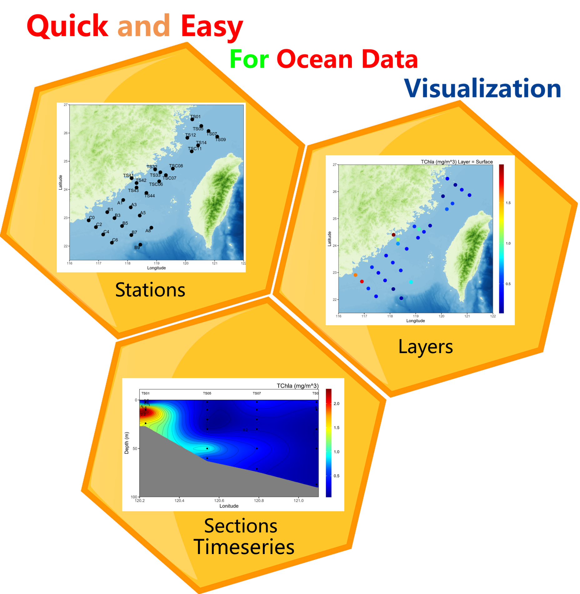

<!-- README.md is generated from README.Rmd. Please edit that file -->

```{r, include = FALSE}
knitr::opts_chunk$set(
  collapse = TRUE,
  comment = "#>",
  fig.path = "man/figures/README-",
  options(warn=-1),
  out.width = "80%"
)
```

# CEGrplot

--------

**CEGrplot** is an open source package developed by the 
**<span style="color:#bed9fd;">Coastal</span>**
**<span style="color:#f09450;">Ecology</span>**
**<span style="color:#00ff00;">Group</span>** **(CEG)** at Xiamen University.<br>
It is designed for visualizing oceanographic data and automatically saving the generated figures.<br>
The Global ETOPO1_15second.nc data included in the package is sourced from NOAA National Centers for Environmental Information.  <DOI: 10.25921/fd45-gt74><br>
Data interpolation is performed using the mba.surf() function from the "MBA" package.<br>

------------

</a>

## :writing_hand: Authors

Weinan Li


Xiamen University<br>
Email: lwnzjou@163.com


## :arrow_double_down: Installation

You can install the development version of CEGrplot like so:<br>
**<span style="color:red;">NOTE!!  Please download the ETOPO1_15second.nc dataset from the following DOI link:</span>** https://doi.org/10.5281/zenodo.14223594,<br>
and then replace the data under: **<span style="color:red;">datafile</span>**

``` r
# install.packages("remotes")
remotes::install_github("wnli596/CEGrplot")
datafile <- system.file('data', package='CEGrplot')
datafile
```
```{r}
#Test
ncfile <- system.file('data/ETOPO1_15second.nc', package='CEGrplot')

if(ncfile == ""){
    print("Please download the ETOPO1_15second.nc dataset from the following DOI link: https://doi.org/10.5281/zenodo.14223594, and then place the data under: ", datafile)
} else {
    print("The package is now ready for use!")
  }
```

## Example

This is a basic example which shows you how to visual data:

```{r message=FALSE}
library(CEGrplot)
library(readxl)
library(lubridate)
#setwd
setwd(
  dirname(
    rstudioapi::getActiveDocumentContext()$path
  )
)
#getwd()
path <- getwd()
#Need a cruise name
cruise <- "TWS001"
```

1. Call package-in data.

```{r eval=TRUE}
file <- system.file('data/exampledata.xlsx', package='CEGrplot')
df <- read_xlsx(file, sheet = 1)
#NOTE! Fixed The colnames: "Station", "Lon", "Lat", "Bot.Depth", "Depth"
names(df)

```


2. Station visualization.

```{r eval=TRUE}
#plot
ceg_station_plot(data = df,
                 lon_min = 116,
                 lon_max = 122,
                 lat_min = 21.5,
                 lat_max = 27,
                 save_width = 10,
                 save_height = 9)  

```

3. Layer visualization.

```{r eval=TRUE}
#Process the data into long data.frame for plotting
df %>%
    group_by(Station) %>%
  #Add a "Layer" column to plot the layer define by the "Depth"
  mutate(Layer = case_when(
    Depth == min(Depth) ~ "Surface",
    Depth == 25 ~ "25 m",
    Depth == max(Depth) ~ "Bottom",
    TRUE ~ NA
  )) %>%
  #Note! Fixed New colnames: "Variable", "Value", "Unit"
  tidyr::pivot_longer(., c = c("Peridinin":"EUK"),
               names_to = "Variable",
               values_to = "Value") %>%
  #Add a "Unit" column that depends on 'Variable' column
  mutate(Unit = case_when(
    Variable %in% c("SYN", "EUK", "PRO") ~ "(Cells/mL)",
    Variable == "TChla" ~ "(mg/m^3)",
    TRUE ~ "(ng/L)"
  )) -> df

unique(df$Variable)
unique(df$Layer)

#plot a single figure
ceg_layer_plot(data = df,
                   lon_min = 116,
                   lon_max = 122,
                   lat_min = 21.5,
                   lat_max = 27,
                   variable = "TChla",
                   layer = "Surface",
                   save_width = 10,
                   save_height = 9)
```

3.1. Iteratively plot the desired variables and layers

```{r eval=FALSE}
#Iteratively plot the desired variables and layers
variables <- c("DV-Chlorophyll.a", "TChla", "SYN", "PRO", "EUK")
layers <- unique(df$Layer[!is.na(df$Layer)])
#iteration
for (v in variables) {
  for (l in layers) {
    print(paste0("ploting:", v, "-", l))
    ceg_layer_plot(data = df,
                   lon_min = 116,
                   lon_max = 122,
                   lat_min = 21.5,
                   lat_max = 27,
                   variable = v,
                   layer = l,
                   save_width = 10,
                   save_height = 9)
  }
}
```

4. Section visualization.

```{r eval=TRUE}
#Section1,2,3...need to be manually defined in the original data
df %>%
  #Note! Fixed New colnames: "Section","Section_name","Direction"
   tidyr::pivot_longer(., c = c("Section1":"Section6"),
               names_to = "Section",
               values_to = "Section_name") %>%
  #Define the "Direction" use "Lon“ or "Lat"
  mutate(Direction = case_when(
    Section == "Section1" ~ "Lat",
    Section == "Section2" ~ "Lat",
    Section == "Section3" ~ "Lon",
    Section == "Section4" ~ "Lon",
    Section == "Section5" ~ "Lon",
    Section == "Section6" ~ "Lon",
    TRUE ~ NA)) -> df
#plot a single figure
ceg_section_plot(data = df,
                   variable = "TChla",
                   section = "Section1",
                   show_Depth = 100,
                   save_width = 10,
                   save_height = 6)


```

4.1. Iteratively plot the desired variables and sections

```{r eval=FALSE}
#Iteratively plot the desired variables and sections
variables <- c("TChla", "EUK")
sections <- unique(df$Section[!is.na(df$Section)])
#iteration
for (v in variables) {
  for (s in sections) {
    print(paste0("ploting:", v, "-", s))
    ceg_section_plot(data = df,
                   variable = v,
                   section = s,
                   res_x = 500,
                   res_y = 500,
                   show_Depth = 100,
                   save_width = 10,
                   save_height = 6)
  }
}
```

5. Timeseries visualization.

```{r eval=TRUE}
timedf <- read_xlsx(system.file('data/timeseriesdata.xlsx', package='CEGrplot'), sheet = 1)
#NOTE! Fixed The colnames: "Station","Time", "Lon", "Lat", "Bot.Depth", "Depth"
names(timedf)
timedf %>%
  #Note! Fixed New colnames: "Variable", "Value", "Unit"
  pivot_longer(., c = c("TChla":"β-carotene"),
               names_to = "Variable",
               values_to = "Value") %>%
   #Add a "Unit" column that depends on 'Variable' column
  mutate(Unit = case_when(
    # Variable %in% c("SYN", "EUK", "PRO") ~ "(Cells/mL)",
    Variable == "TChla" ~ "(mg/m^3)",
    TRUE ~ "(ng/L)"
  )) %>%
  mutate(Time = as.POSIXct(Time, format="%Y-%m-%dT%H:%M:%S"))-> timedf
#plot a single figure
ceg_timeseries_plot(data = timedf,
                    variable = "TChla",
                    station = "P3",
                    save_width = 12,
                    save_height = 6)


```

5.1 Iteratively plot the desired variables and stations.

```{r eval=FALSE}
#Iteratively plot the desired variables and stations
variables <- c("DV-chlorophyll.a", "α-carotene", "β-carotene")
stations <- unique(df$Station[!is.na(df$Station)])
#iteration
for (v in variables) {
  for (s in stations) {
    print(paste0("ploting:", v, "-", s))
    ceg_timeseries_plot(data = df,
                     variable = v,
                     station = s,
                     res_x = 500,
                     res_y = 500,
                     save_width = 12,
                     save_height = 6)
  }
}
```


## :sparkling_heart: Contributing

We welcome any contributions! By participating in this project you agree to
abide by the terms outlined in the [Contributor Code of Conduct](CONDUCT.md).
